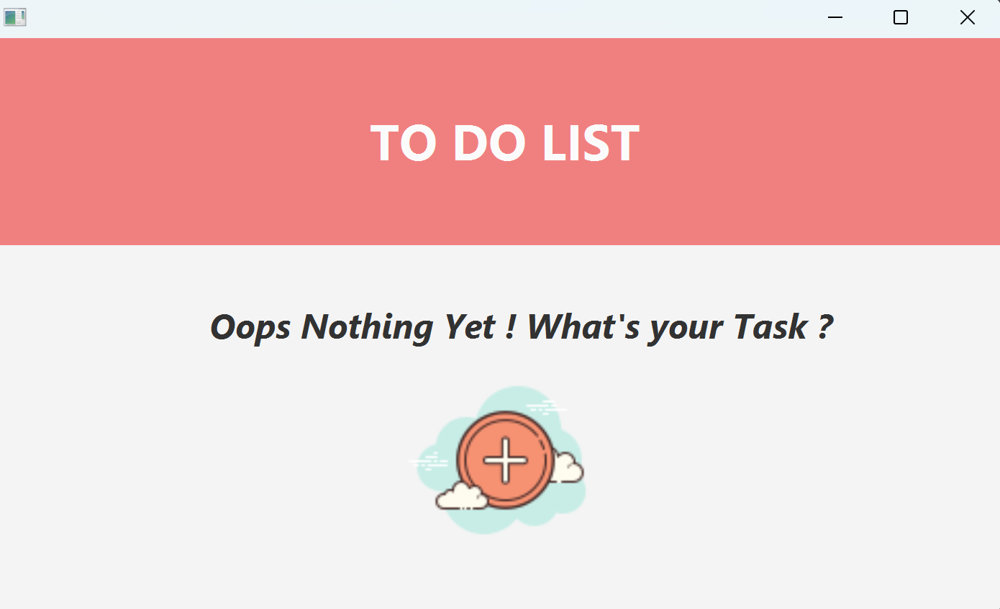
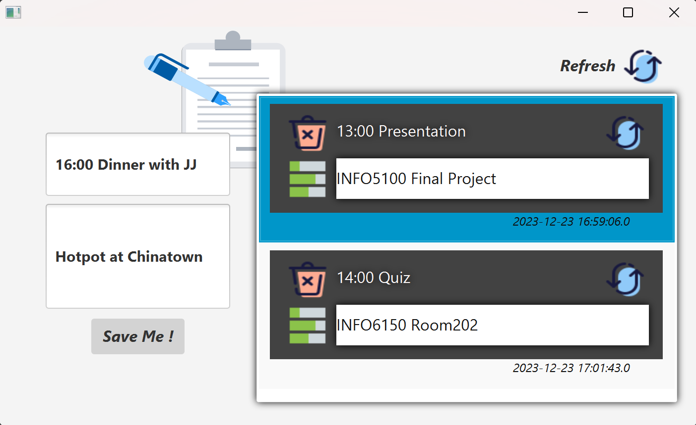
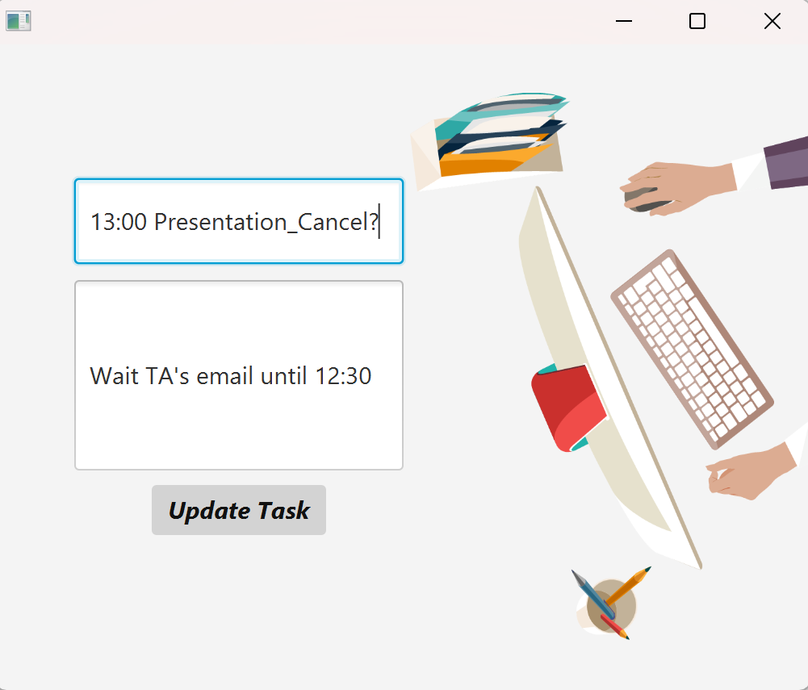

<h1 align="center"> Task Manager</h1>

A Task Management System as the final project of NEU course INFO5100 Application Engineering and Development.  

<!-- TOC -->
* [📑 Overview](#-overview)
* [💻 Environment](#-environment)
* [🛠 Installation](#-installation)
* [🚀 Technologies](#-technologies)
<!-- TOC -->

# 📑 Overview
In this project, I built a Task Management System based on JavaFX and MySQL for efficient daily tasks arrangement. 
### Preview

# 💻 Environment
1. [JavaFx](https://openjfx.io/), tutorial [Getting Started](https://openjfx.io/openjfx-docs/)

2. [SceneBuilder](https://gluonhq.com/products/scene-builder/)

# 🛠 Installation
1. Clone the repository into your local machine
2. Download [JavaFX SDK](https://gluonhq.com/products/javafx/) and [MySQL](https://dev.mysql.com/downloads/installer/)

# 🚀 Technologies
This project was developed with the following technologies:
- JavaFX
- MVC design pattern
- MySQL
- SceneBuilder
- IntelliJ
  
OOD concepts used:
- Inheritance/Polymorphism
- Abstract Classes/Interfaces
- Generics/Collections/Iterators

Data structure used:  
- Lists, Stacks, Queues/Priority Queues, Set/MapsGraph

Other tools used:  
- Git&GitHub
- Google Drive
- Trello team/tasks management

[⬆ Back to the top] 

